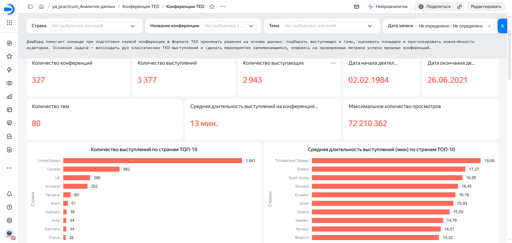
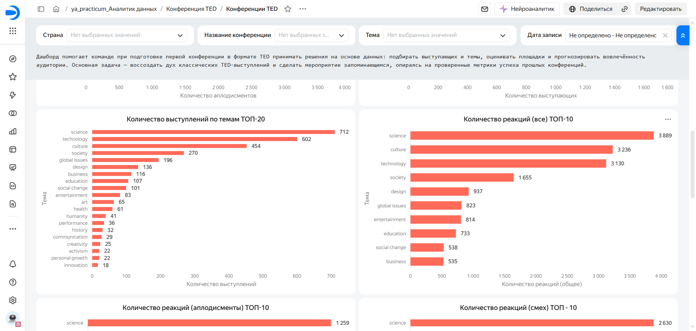
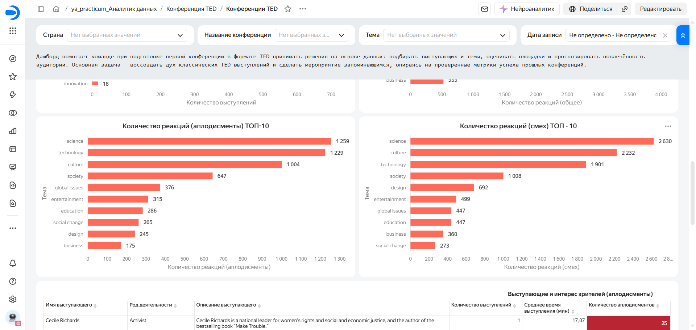
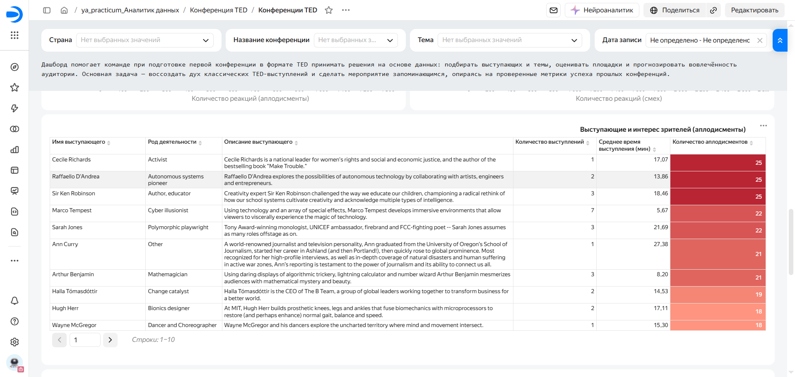

# Дашборд TED-конференций в DataLens

Учебный проект по разработке интерактивного дашборда для анализа TED-конференций.  
Цель — помочь организатору конференции принимать решения на основе данных: выбирать спикеров, понимать популярные темы и эффективно планировать время выступлений.

**Автор:** Oleg Doronin ([@Logos-AOD](https://github.com/Logos-AOD))  

**Направление:** Data Analyst

**Email:** doroninoleg@yandex.ru

**Telegram:** @Oleg7160

**Дашборд:** [Открыть в DataLens](https://datalens.ru/ghcevontg68iz-konferencii-ted?_share_link=org)

---

## Используемые инструменты

**Языки: SQL**

- **CTE (`WITH`)** — для агрегации и подготовки выборок
- **Агрегатные функции** — `AVG`, `MIN`, `MAX`, `COUNT`, `ROUND`
- **Фильтрация через `LIKE`** — для поиска по текстовым полям
- **Оконные / вложенные подзапросы** — для расчёта топов и ранжирования
- **JOIN и LEFT JOIN** — для связи таблиц `events`, `speakers`, `talks`
- **CASE** — для категоризации и вычисляемых полей
- **COALESCE** — для обработки `NULL`
- **FILTER** — для условной агрегации

**Базы данных:**
![PostgreSQL]

**Инструменты:**
![DBeaver]
![DataLens]
![VS Code]

---

## Задачи исследования

1. Изучить данные о выступлениях TED-конференций.
2. Подготовить дашборд с ключевыми метриками:
   - количество конференций;
   - количество выступлений;
   - количество тем / тегов;
   - средняя длительность выступления;
   - максимальное количество просмотров;
   - сколько раз выступления добавляли в избранное;
   - топ-10 самых популярных выступлений;
   - топ-20 популярных тегов.
3. Добавить информацию о выступающих:
   - род деятельности;
   - количество выступлений;
   - возможность перейти на страницу выступления и спикера.
4. Настроить фильтры:
   - страна;
   - название конференции;
   - тег;
   - выступающий;
   - дата.

---

## Данные

Источник — **PostgreSQL**.  
Таблицы: `events`, `speakers`, `talks` со следующими ключевыми полями:

### `events`
Содержит информацию о конференциях:
- `conf_id` — идентификатор конференции;
- `event_name` — название конференции;
- `country` — страна проведения.

### `speakers`
Содержит информацию о выступающих:
- `author_id` — идентификатор выступающего;
- `speaker_name` — имя выступающего;
- `speaker_profession` — род деятельности;
- `speaker_description` — краткое описание.

### `talks`
Содержит информацию о выступлениях:
- `talk_id` — идентификатор выступления;
- `url` — ссылка на выступление;
- `title` — название;
- `description` — описание;
- `film_date` — дата выступления;
- `duration` — длительность;
- `views_count` — количество просмотров;
- `main_tag` — основной тег;
- `speaker_id` — идентификатор выступающего;
- `laughs_count` — количество смехов;
- `applause_count` — количество аплодисментов;
- `language` — язык;
- `event_id` — идентификатор конференции.

---

## Дашборд

| Общие показатели | Выступления по темам |
|---|---|
|  |  |

| Реакции | Выступающие |
|---|---|
|  |  |

1. Заголовок дашборда.
2. Фильтры:
   - страна;
   - конференция;
   - тег;
   - выступающий;
   - дата.
3. Ключевые показатели:
   - конференции;
   - выступления;
   - темы;
   - средняя длительность.
4. Динамика выступлений.
5. Топ-10 выступлений.
6. Топ-20 тегов.
7. Информация о выступающих.
8. Детализация по выступлениям.

[Открыть дашборд](https://datalens.ru/ghcevontg68iz-konferencii-ted?_share_link=org)

---

